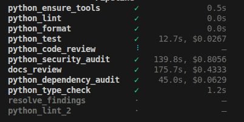
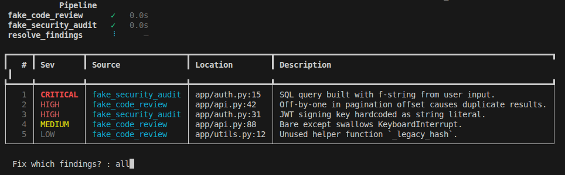

# codemonkeys

Deterministic AI pipelines with per-node model selection, least-privilege permissions, and guaranteed execution. Built on the [Claude Agent SDK](https://code.claude.com/docs/en/agent-sdk/overview).



*Python quality gate mid-run — shell nodes complete in seconds, Claude agents run in parallel with per-node cost tracking.*


*Interactive findings triage — color-coded severity, source attribution, and selective fix prompting.*

## Why not just use Claude Code?

Claude Code (with plugins like superpowers) is excellent for interactive work — brainstorming, implementing features with human-in-the-loop review, debugging. A skilled developer steering Claude through a conversation will outperform any automated pipeline for novel, judgment-heavy tasks.

codemonkeys solves a different problem: **repeatable, unattended, cost-controlled code operations** where you need guarantees that a conversation can't provide.

### What codemonkeys gives you

**Per-node model selection.** Each pipeline step runs its own Claude instance on a specific model. Run dependency audit on Haiku ($0.25/MTok), test analysis on Sonnet ($3/MTok), and code review on Opus ($15/MTok). A Claude Code session uses one model for all subagents unless you manually override each dispatch.

**Per-node permissions.** Each node gets explicit allow/deny lists. The code reviewer can Read and Grep but can't Edit. The test runner can run pytest but can't pip install. The commit node can `git add` and `git commit` but not `git push`. Claude Code subagents inherit the session's permission mode — a subagent asked to "review code" could still edit files if it decides to.

**Guaranteed execution.** The pipeline topology is deterministic. If you define 5 parallel review nodes, all 5 run. A skill prompt says "run lint, then review, then test" but Claude might skip steps, combine them, or decide one isn't needed. The pipeline doesn't interpret — it executes.

**Cost tracking and controls.** Every node reports its token cost. Per-node budget caps and model tier selection give you visibility and control over spend. A Claude Code session gives you a single bill at the end.

**Structured, machine-readable output.** Each node defines a Pydantic model for its output. The framework auto-generates output instructions in the prompt and validates the response — no regex, no string parsing. Downstream nodes consume typed objects: `ResolveFindings` walks upstream models for findings and presents a numbered list for triage. Claude Code subagents produce free-text summaries that require human interpretation.

### When Claude Code alone is enough

- **Interactive development** — brainstorming, planning, implementing features with a human reviewing each step.
- **One-off tasks** — "fix this bug," "add this endpoint," "refactor this module." The overhead of defining a pipeline isn't worth it for work you'll do once.
- **Novel, ambiguous work** — tasks where you don't know the steps upfront. A conversation adapts; a pipeline executes a fixed topology.
- **Small repos or solo projects** — if the cost of running 5 parallel review nodes isn't justified by the codebase size or team requirements.

### When you need codemonkeys

- **CI/CD quality gates** — run on every PR with guaranteed lint, test, review, security scan, dependency audit. Post structured results. No human babysitting.
- **Compliance/audit pipelines** — nightly security scan with Opus, license check with Haiku, SBOM generation with a shell node. Read-only permissions guarantee audit integrity.
- **Codebase migrations** — plan → implement → test → review across 50 modules. Each step has least-privilege permissions and a cost ceiling. Track spend per module.
- **Multi-team repos** — Python quality gate for backend, JS gate for frontend, shared security audit. Each sub-pipeline uses language-specific skills and models.

## Install

```bash
.venv/bin/python3 -m pip install -e .              # core only
.venv/bin/python3 -m pip install -e ".[python]"    # + pytest, pytest-cov, pip-audit, ruff, mypy
.venv/bin/python3 -m pip install -e ".[dev]"       # + pytest-asyncio
```

```bash
export ANTHROPIC_API_KEY=...
```

## Run

```bash
.venv/bin/python3 -m codemonkeys.cli python check .
.venv/bin/python3 -m codemonkeys.cli python check /path/to/repo --base-ref develop
.venv/bin/python3 -m codemonkeys.cli python check . --no-interactive --verbosity verbose
```

## Quick start

```python
import asyncio
from codemonkeys import Pipeline, Verbosity
from codemonkeys.nodes.python_lint import PythonLint
from codemonkeys.nodes.python_format import PythonFormat
from codemonkeys.nodes.python_code_review import PythonCodeReview
from codemonkeys.nodes.python_security_audit import PythonSecurityAudit
from codemonkeys.nodes.python_test import PythonTest
from codemonkeys.nodes.resolve_findings import ResolveFindings

async def main():
    test = PythonTest()
    review = PythonCodeReview()
    security = PythonSecurityAudit()

    pipeline = Pipeline(
        working_dir="/path/to/repo",
        task="Check code quality",
        steps=[
            PythonLint(),
            PythonFormat(),
            [test, review, security],  # parallel
            ResolveFindings(reads_from=[test, review, security]),
        ],
        verbosity=Verbosity.normal,
    )
    await pipeline.run()
    pipeline.print_results()

asyncio.run(main())
```

Steps are node instances. Lists create parallel fan-out via `asyncio.gather`. Each node's `.name` attribute is used as its output key in state.

## Built-in nodes

Every node does one thing. Instantiate the class to get a configured node.

### Quality (ClaudeAgentNodes)

Each owns a single concern. They do not overlap — code review doesn't run linters, security audit doesn't check code quality, etc.

| Class | What it does |
|---|---|
| `PythonCodeReview` | Semantic code review. Logic errors, deep nesting, error handling gaps, resource leaks, concurrency bugs, dead code. Does NOT run linters or tests. |
| `PythonSecurityAudit` | Traces data flow from inputs to sinks. Injection, auth bypass, hardcoded secrets, unsafe deserialization, data exposure. No external scanners. |
| `DocsReview` | Doc drift detection. Checks docstrings, README, CHANGELOG against actual code for accuracy. |
| `PythonTest` | Runs pytest, reads failing tests and the code under test to identify root causes. |
| `PythonDependencyAudit` | Runs `pip-audit` to scan for CVEs, reports findings with CVSS-based severity. Read-only by default. |
| `ResolveFindings` | Extracts findings from upstream nodes, optionally prompts the user for selection, delegates to an inner agent to apply fixes. |

All `ClaudeAgentNode` quality nodes default to read-only. Pass Edit/Write in the allow list to enable fixing.

### Python tooling (ShellNodes)

| Class | What it does |
|---|---|
| `PythonLint` | Runs `ruff check --fix`. |
| `PythonFormat` | Runs `ruff format`. |
| `PythonTypeCheck` | Runs `mypy --output json`, parses results into a `TypeCheckOutput` Pydantic model. |
| `PythonEnsureTools` | Preflight check — installs `codemonkeys[python]` tools if missing. |

These are `ShellNode` instances — they run subprocesses directly, no LLM call. They don't accept `model`, `allow`/`deny`, or `extra_skills`.

## Permissions

Every node always tries to find and fix issues. Permissions decide what actually happens:

1. **allow/deny** — what tools the agent can use. Default: read-only (Edit/Write denied).
2. **on_unmatched** — what happens for tool calls not covered by allow/deny:
   - `"deny"`: block (default — report-only)
   - `"allow"`: auto-approve (CI / fully automatic)
   - `ask_via_stdin`: prompt the user per call

```python
from codemonkeys.nodes.python_code_review import PythonCodeReview
from codemonkeys.permissions import ask_via_stdin

# Report only (default):
PythonCodeReview()

# Auto-fix everything:
PythonCodeReview(
    allow=["Read", "Glob", "Grep", "Bash", "Edit", "Write"],
    deny=["Bash(git push*)"],
)

# Prompt user per edit:
PythonCodeReview(
    allow=["Read", "Glob", "Grep", "Bash", "Edit", "Write"],
    deny=["Bash(git push*)"],
    on_unmatched=ask_via_stdin,
)
```

### Permission rule syntax

Same syntax as Claude Code's `settings.local.json`:

| Rule | Meaning |
|---|---|
| `"Read"` | every Read call |
| `"Bash(python*)"` | Bash where `command` matches `python*` |
| `"Bash(git push*)"` | Bash where `command` matches `git push*` |
| `"Edit(*.py)"` | Edit where `file_path` matches `*.py` |

Deny always wins over allow.

## Pipeline

`Pipeline` takes node instances directly and runs them with `asyncio`.

```python
from codemonkeys import Pipeline, Verbosity
from codemonkeys.nodes.python_lint import PythonLint
from codemonkeys.nodes.python_test import PythonTest
from codemonkeys.nodes.python_code_review import PythonCodeReview
from codemonkeys.nodes.python_security_audit import PythonSecurityAudit
from codemonkeys.nodes.resolve_findings import ResolveFindings

test = PythonTest()
review = PythonCodeReview(scope="diff")
security = PythonSecurityAudit()

Pipeline(
    working_dir="/path/to/repo",
    task="description of what to do",
    steps=[
        PythonLint(),
        [test, review, security],  # parallel
        ResolveFindings(reads_from=[test, review, security]),
        ("lint_final", PythonLint()),  # tuple: (alias, node) for name override
    ],
    verbosity=Verbosity.normal,
    extra_state={"base_ref": "main"},
)
```

Nodes that consume upstream output declare `reads_from` — a list of node instances (or names) whose output gets injected into the prompt. This keeps token costs down by only passing relevant results, not the entire state.

| Parameter | What it does |
|---|---|
| **steps** | Node instances, `(alias, node)` tuples for name overrides, or nested lists for parallel fan-out. |
| **verbosity** | `Verbosity.silent` (default), `.status` (table only), `.normal`, or `.verbose`. |
| **extra_state** | Additional key-value pairs merged into the initial state dict. |

Duplicate node names are auto-suffixed (e.g. two `PythonLint()` steps become `python_lint` and `python_lint_2`). Any `(state) -> dict` callable works as a step — the name is taken from `.name` or `__name__`.

## Pre-built pipelines

**`python check`** — lint → format → parallel (test + code review + security audit + docs review + dependency audit + type check) → resolve findings → final lint. No branch, no commit.

```bash
codemonkeys python check /path/to/repo
# or as a module:
python -m codemonkeys.graphs.python.check /path/to/repo
```

## Building blocks

**`ClaudeAgentNode`** — wraps `claude_agent_sdk.query()`:

```python
from pydantic import BaseModel, Field
from codemonkeys import ClaudeAgentNode, PYTHON_CLEAN_CODE

class ReviewOutput(BaseModel):
    findings: list[dict] = Field(default_factory=list)
    summary: str = Field(examples=["No issues found."])

reviewer = ClaudeAgentNode(
    name="reviewer",
    system_prompt="You review pull requests.",
    output=ReviewOutput,  # auto-generates output instructions, validates response
    skills=[PYTHON_CLEAN_CODE],
    allow=["Read", "Glob", "Grep", "Bash(git diff*)"],
    deny=["Bash(git push*)"],
    prompt_template="Review the diff for {git_new_branch}.",
)
```

**`ShellNode`** — runs a subprocess:

```python
from pydantic import BaseModel
from codemonkeys import ShellNode

class TestResult(BaseModel):
    passed: int
    failed: int

run_tests = ShellNode(name="tests", command="pytest -x", output=TestResult)
```

**Plain functions** — any `(state) -> dict` callable works as a node.

## Cost controls

```python
ClaudeAgentNode(
    ...,
    max_budget_usd=0.50,
    hard_cap=False,            # False = warning-only
    warn_at_pct=[0.8, 0.95],
)
```

Each run writes `last_cost_usd` into state. Other levers: cheaper models, turn caps (`max_turns=10`), tighter allow lists.

## Language skills

Language-specific clean code and security guidance are constants under `codemonkeys.skills`:

```python
from codemonkeys.skills import PYTHON_CLEAN_CODE, PYTHON_SECURITY

PythonCodeReview(extra_skills=[PYTHON_CLEAN_CODE])
```

| Constant | Language |
|---|---|
| `PYTHON_CLEAN_CODE`, `PYTHON_SECURITY` | Python |
| `JAVASCRIPT_CLEAN_CODE`, `JAVASCRIPT_SECURITY` | JavaScript |
| `RUST_CLEAN_CODE`, `RUST_SECURITY` | Rust |

Pass via `extra_skills` on any node class, or `skills` on a raw `ClaudeAgentNode`.

## Bedrock and Vertex AI

The Claude Agent SDK honors the same backend toggles as Claude Code:

```bash
# Bedrock
export CLAUDE_CODE_USE_BEDROCK=1
export AWS_REGION=us-west-2

# Vertex AI
export CLAUDE_CODE_USE_VERTEX=1
export CLOUD_ML_REGION=us-east5
export ANTHROPIC_VERTEX_PROJECT_ID=my-project
```

Model IDs are resolved automatically via `resolve_model()` — standard Anthropic IDs (e.g. `SONNET_4_6`) are translated to the correct Bedrock/Vertex ID when the env var is set. You can still pass a provider-specific ID to override:

```python
# Automatic — uses resolve_model() internally:
PythonCodeReview(model="claude-sonnet-4-20250514")

# Manual override:
PythonCodeReview(model="us.anthropic.claude-opus-4-7-20251201-v1:0")
```

## Tests

```bash
.venv/bin/python3 -m pip install -e ".[dev]"
.venv/bin/python3 -m pytest tests/ -x -q --no-header
```
